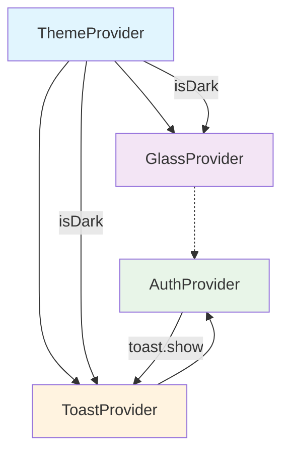

# Providers System Documentation

*This file documents the provider system implementation, including theme management and authentication context within `/src/shared/providers/`.*

## Theme Architecture

### **Multi-Mode Theme System**
- **Light Mode**: 浅色主题，适合日间使用
- **Dark Mode**: 深色主题，适合夜间使用  
- **Auto Mode**: 自动跟随系统设置切换

### **Theme Context Structure**
```typescript
interface ThemeContextType {
  theme: typeof lightTheme | typeof darkTheme;  // 当前激活主题对象
  themeMode: 'light' | 'dark' | 'auto';          // 用户选择的主题模式
  isDark: boolean;                               // 当前是否为深色模式
  setThemeMode: (mode: ThemeMode) => Promise<void>;     // 设置主题模式
  toggleTheme: () => Promise<void>;                     // 三模式循环切换
  toggleLightDark: () => Promise<void>;                 // 浅色/深色直接切换
  getThemeModeLabel: () => string;                      // 获取模式显示名称
}
```

### **System Integration Points**
- **React Native useColorScheme**: 检测系统颜色偏好
- **AsyncStorage**: 持久化用户主题选择
- **React Context**: 全局主题状态管理
- **useMemo Optimization**: 避免不必要的重渲染

## Implementation Patterns

### **Theme Provider Architecture**
```typescript
// 提供器组件结构
export function ThemeProvider({ 
  children, 
  defaultMode = 'auto' 
}: ThemeProviderProps) {
  const systemColorScheme = useColorScheme();
  const [themeMode, setThemeModeState] = useState<ThemeMode>(defaultMode);
  const [isLoading, setIsLoading] = useState(true);

  // 系统主题检测和持久化逻辑
  // ...
}
```

### **Dynamic Theme Selection Logic**
```typescript
// 智能主题选择算法
const isDark = useMemo(() => {
  if (themeMode === 'auto') {
    return systemColorScheme === 'dark';  // 跟随系统
  }
  return themeMode === 'dark';           // 用户手动选择
}, [themeMode, systemColorScheme]);

const theme = useMemo(() => {
  return isDark ? themes.dark : themes.light;
}, [isDark]);
```

### **Theme Switching Functions**
```typescript
// 1. 完整三模式切换（light → dark → auto → light）
const toggleTheme = async () => {
  const newMode = themeMode === 'light' ? 'dark' : 
                  themeMode === 'dark' ? 'auto' : 'light';
  await setThemeMode(newMode);
};

// 2. 浅色/深色直接切换（跳过auto模式）
const toggleLightDark = async () => {
  if (themeMode === 'auto') {
    const newMode = isDark ? 'light' : 'dark';  // 基于当前显示效果
    await setThemeMode(newMode);
  } else {
    const newMode = themeMode === 'light' ? 'dark' : 'light';
    await setThemeMode(newMode);
  }
};

// 3. 直接设置模式（编程式控制）
const setThemeMode = async (mode: ThemeMode) => {
  await AsyncStorage.setItem(THEME_STORAGE_KEY, mode);
  setThemeModeState(mode);
};
```

## Authentication Architecture

### **AuthProvider System (Moved to Features Layer)**
**注意**: AuthProvider已迁移到`src/features/auth/providers/`，不再属于shared层架构。
企业级认证状态管理系统，采用类基架构提供完整的认证功能：

- **Class-Based Architecture**: AuthStateManager、CooldownManager、AuthAPI 三层类架构
- **Enhanced State Machines**: 页面级8状态机与提供器级4状态机协同工作
- **Cooldown Protection**: 双层冷却系统（发送60s，验证3s）与装饰器模式保护
- **Memory Safety**: 全面的组件生命周期跟踪和异步操作保护
- **Centralized Configuration**: AuthConfig统一管理所有认证常量和消息
- **API Encapsulation**: AuthAPI类提供统一的Supabase接口封装
- **Multi-Auth Support**: 邮箱+密码认证、OTP Magic Link 认证
- **Session Management**: 自动会话管理和持久化，跨应用启动保持登录状态
- **Real-time State Sync**: 通过 Supabase onAuthStateChange 监听器实时同步认证状态
- **Resilient Architecture**: 网络容错设计，确保在网络问题时仍可正常退出
- **Toast Integration**: 与全局Toast通知系统深度集成，包含冷却状态反馈

### **Enhanced Auth Context Structure**
```typescript
type AuthStatus = 
  | 'initializing'   // 应用启动时的认证状态检查
  | 'unauthenticated' // 未登录
  | 'authenticated'   // 已登录
  | 'verifying';      // 认证验证进行中

// 基于 AuthState 接口的统一状态结构
interface AuthState {
  session: Session | null;                          // 当前用户会话
  status: AuthStatus;                               // 状态机状态
  isSendingCode: boolean;                           // 是否正在发送验证码
  sendCodeCooldown: number;                         // 发送验证码冷却时间(秒)
  verifyCooldown: number;                           // 验证操作冷却时间(秒)
}

interface AuthContextType extends AuthState {
  // 派生状态 - 提升性能，避免重复计算
  isInitializing: boolean;                          // 是否初始化中
  isVerifying: boolean;                             // 是否验证中
  
  // 类基认证操作（通过依赖注入模式）
  signIn: (email: string, password: string) => Promise<void>;  // 邮箱+密码登录
  signOut: (silent?: boolean) => Promise<void>;                // 退出登录（支持静默模式）
  sendCode: (email: string, mode: 'login' | 'forgotPassword') => Promise<void>;         // 统一发送验证码
  verifyCode: (email: string, code: string, mode: 'login' | 'forgotPassword') => Promise<void>;   // 统一验证码验证
  setPassword: (newPassword: string, mode?: 'set' | 'reset') => Promise<void>;       // 设置密码（支持模式参数）
}
```

### **State Machine Architecture**
```typescript
// 状态机简化事件处理 - 批量状态更新提升性能
if (event === 'INITIAL_SESSION') {
  log('auth', LogType.INFO, 'AuthProvider: 初始会话加载完成');
  // 批量状态更新，减少渲染次数
  setSession(session);
  setStatus(session ? 'authenticated' : 'unauthenticated');
  if (error) setError(null); // 清除之前的错误
} else if (event === 'SIGNED_IN') {
  log('auth', LogType.INFO, 'AuthProvider: 用户登录成功');
  setSession(session);
  setStatus('authenticated');
  if (error) setError(null);
} else if (event === 'SIGNED_OUT') {
  log('auth', LogType.INFO, 'AuthProvider: 用户退出登录');
  setSession(null);
  setStatus('unauthenticated');
  if (error) setError(null);
}
```

### **Memory Leak Prevention Pattern**
```typescript
// 防止内存泄漏的组件挂载状态跟踪
const isMountedRef = useRef(true);

useEffect(() => {
  // Setup authentication state listener
  return () => {
    isMountedRef.current = false; // 立即标记组件已卸载
  };
}, []);

// 异步操作中的安全检查
if (!isMountedRef.current) {
  log('auth', LogType.DEBUG, 'Component unmounted, skip state update');
  return;
}
```

### **Performance Optimization Pattern**
```typescript
// 性能优化：创建稳定的context值，减少不必要的重新渲染
const value: AuthContextType = useMemo(() => ({
  session,
  status,
  // 派生状态 - 避免额外的状态变量
  isInitializing: status === 'initializing',
  isVerifying: status === 'verifying',
  error,
  signIn,
  signOut,
  clearError,
}), [session, status, error]); // 只在核心状态变化时重新创建
```

### **Error Handling Utility Functions**
```typescript
// 错误处理工具函数 - 提升代码可维护性
const getFriendlyErrorMessage = (supabaseError: { message: string }): string => {
  if (supabaseError.message.includes('Invalid login credentials')) {
    return '邮箱或密码错误';
  }
  if (supabaseError.message.includes('Email not confirmed')) {
    return '请先验证您的邮箱';
  }
  if (supabaseError.message.includes('Too many requests')) {
    return '请求过于频繁，请稍后重试';
  }
  return '登录失败，请重试';
};

// 智能错误分类工具函数 - 区分用户错误与系统错误
const isUserError = (error: any): boolean => {
  const message = error?.message?.toLowerCase() || '';
  
  const userErrorPatterns = [
    'token has expired or is invalid',  // 验证码过期或无效
    'invalid login credentials',         // 登录凭据无效
    'user not found',                   // 用户不存在
    'email not confirmed',              // 邮箱未确认
    'invalid email format',             // 邮箱格式无效
    'password is too short',            // 密码太短
    'weak password',                    // 密码太弱
    'email already registered',         // 邮箱已注册
  ];
  
  return userErrorPatterns.some(pattern => message.includes(pattern));
};
```

### **Intelligent Error Logging Pattern**
AuthProvider 实现了智能错误日志记录，根据错误类型使用不同的日志级别：

```typescript
// 应用于所有认证方法的错误日志模式
const handleAuthError = (error: any, operation: string) => {
  const logLevel = isUserError(error) ? LogType.WARNING : LogType.ERROR;
  log('auth', logLevel, `${operation}失败 - ${error.message}`);
};

// 在登录、发送验证码、验证OTP等方法中使用
if (supabaseError) {
  const logLevel = isUserError(supabaseError) ? LogType.WARNING : LogType.ERROR;
  log('auth', logLevel, `AuthProvider: 操作失败 - ${friendlyMessage}`);
}
```

**日志级别策略**:
- **LogType.WARNING**: 用户错误 (过期令牌、无效凭据、用户不存在等)
- **LogType.ERROR**: 系统错误 (网络问题、服务器错误、配置问题等)

### **Complete Authentication Flow Implementation**

#### **1. Email + Password Login**
```typescript
const signIn = async (email: string, password: string) => {
  log('auth', LogType.INFO, `AuthProvider: 开始真实登录 - 邮箱: ${email}`);
  
  // 内存安全检查
  if (!isMountedRef.current) {
    log('auth', LogType.DEBUG, 'AuthProvider: 组件已卸载，取消登录操作');
    return;
  }
  
  try {
    // 状态机更新 - 进入验证状态
    setStatus('verifying');
    if (error) setError(null);
    
    // 调用真实的 Supabase API
    const { data, error: supabaseError } = await supabase.auth.signInWithPassword({
      email: email.trim(),
      password: password,
    });
    
    if (supabaseError) {
      const friendlyMessage = getFriendlyErrorMessage(supabaseError);
      const logLevel = isUserError(supabaseError) ? LogType.WARNING : LogType.ERROR;
      log('auth', logLevel, `AuthProvider: 登录失败 - ${friendlyMessage}`);
      throw new Error(friendlyMessage);
    }

    if (!data.user || !data.session) {
      log('auth', LogType.ERROR, 'AuthProvider: Supabase 返回数据异常');
      throw new Error('登录异常，请重试');
    }

    log('auth', LogType.INFO, `AuthProvider: Supabase 登录成功 - 用户ID: ${data.user.id}`);
    
  } catch (err) {
    // 内存安全的错误处理
    if (!isMountedRef.current) {
      log('auth', LogType.DEBUG, 'AuthProvider: 组件已卸载，跳过错误状态更新');
      throw err;
    }
    
    const authError: AuthError = {
      message: err instanceof Error ? err.message : '登录失败，请重试',
      code: 'SUPABASE_LOGIN_ERROR'
    };
    
    setError(authError);
    setStatus('error');
    throw authError;
  } finally {
    log('auth', LogType.INFO, 'AuthProvider: 登录流程结束');
  }
};
```

#### **2. Unified OTP Authentication Flow**
```typescript
// 统一发送验证码 - 支持登录和忘记密码两种模式
const sendCode = async (email: string, mode: 'login' | 'forgotPassword') => {
  log('auth', LogType.INFO, `AuthProvider: 开始发送验证码 - 模式: ${mode}, 邮箱: ${email}`);
  
  if (!email?.trim()) {
    throw new Error('邮箱不能为空');
  }
  
  try {
    setIsSendingCode(true);
    if (error) setError(null);
    
    // 根据模式选择不同的API调用
    const { error: sendError } = mode === 'login' 
      ? await supabase.auth.signInWithOtp({
          email: email.trim(),
          options: { shouldCreateUser: true }
        })
      : await supabase.auth.resetPasswordForEmail(email.trim(), {
          redirectTo: window.location.origin + '/auth/reset-password'
        });
    
    if (sendError) {
      const logLevel = isUserError(sendError) ? LogType.WARNING : LogType.ERROR;
      log('auth', logLevel, `发送验证码失败 (${mode}): ${sendError.message}`);
      throw new Error(sendError.message || '发送验证码失败，请重试');
    }
    
    log('auth', LogType.INFO, `AuthProvider: 验证码发送成功 - 模式: ${mode}, 邮箱: ${email}`);
    
  } catch (err) {
    if (isMountedRef.current) {
      const authError: AuthError = {
        message: err instanceof Error ? err.message : '发送验证码失败，请重试',
        code: 'SUPABASE_SEND_CODE_ERROR'
      };
      setError(authError);
      throw authError;
    }
  } finally {
    setIsSendingCode(false);
    log('auth', LogType.INFO, `AuthProvider: 发送验证码流程结束 - 模式: ${mode}`);
  }
};

// 统一验证码验证 - 支持登录和密码重置两种模式
const verifyCode = async (email: string, code: string, mode: 'login' | 'forgotPassword') => {
  log('auth', LogType.INFO, `AuthProvider: 开始验证码验证 - 模式: ${mode}, 邮箱: ${email}`);
  
  if (!email?.trim() || !code?.trim()) {
    throw new Error('邮箱和验证码不能为空');
  }
  
  try {
    setStatus('verifying');
    if (error) setError(null);
    
    // 根据模式选择不同的验证类型
    const verifyType = mode === 'login' ? 'email' : 'recovery';
    const { data: verifyData, error: verifyError } = await supabase.auth.verifyOtp({
      email: email.trim(),
      token: code.trim(),
      type: verifyType
    });

    if (verifyError) {
      const logLevel = isUserError(verifyError) ? LogType.WARNING : LogType.ERROR;
      log('auth', logLevel, `验证码验证失败 (${mode}): ${verifyError.message}`);
      throw new Error(verifyError.message || '验证码验证失败，请重试');
    }

    if (verifyData?.user && verifyData?.session) {
      log('auth', LogType.INFO, `AuthProvider: 验证码验证成功 - 模式: ${mode}, 用户ID: ${verifyData.user.id}`);
    } else {
      log('auth', LogType.ERROR, `验证返回数据异常 (${mode}) - 缺少用户或会话信息`);
      throw new Error('验证异常，请重试');
    }
    
  } catch (err) {
    if (isMountedRef.current) {
      const authError: AuthError = {
        message: err instanceof Error ? err.message : '验证码验证失败，请重试',
        code: 'SUPABASE_VERIFY_CODE_ERROR'
      };
      setError(authError);
      setStatus('error');
      throw authError;
    }
  } finally {
    log('auth', LogType.INFO, `AuthProvider: 验证码验证流程结束 - 模式: ${mode}`);
  }
};
```

#### **3. Password Setting for OTP Users**
```typescript
// 为通过OTP登录的用户设置密码，确保has_password标志正确维护
const setPassword = async (newPassword: string) => {
  log('auth', LogType.INFO, `AuthProvider: 开始设置密码 - 密码长度: ${newPassword.length}`);
  
  if (!isMountedRef.current) {
    log('auth', LogType.DEBUG, 'AuthProvider: 组件已卸载，取消设置密码操作');
    return;
  }
  
  if (!newPassword?.trim()) {
    throw new Error('密码不能为空');
  }
  
  try {
    setStatus('verifying');
    setError(null);
    
    log('auth', LogType.INFO, 'AuthProvider: 调用 Supabase updateUser API 设置密码并更新 has_password 标志');
    
    // 使用真实的 Supabase updateUser API 设置密码
    // 同时更新 user_metadata.has_password 标志，确保后续登录流程正确
    const { data, error: supabaseError } = await supabase.auth.updateUser({
      password: newPassword.trim(),
      data: { has_password: true }  // 关键修复：手动维护密码状态标志
    });
    
    if (supabaseError) {
      const friendlyMessage = getFriendlyErrorMessage(supabaseError);
      const logLevel = isUserError(supabaseError) ? LogType.WARNING : LogType.ERROR;
      log('auth', logLevel, `AuthProvider: 设置密码失败 - ${friendlyMessage}`);
      
      toast.show({
        type: 'error',
        title: '设置密码失败',
        message: friendlyMessage
      });
      
      throw new Error(friendlyMessage);
    }

    if (!data.user) {
      log('auth', LogType.ERROR, 'AuthProvider: Supabase 返回数据异常 - 缺少用户信息');
      toast.show({
        type: 'error',
        title: '设置密码异常',
        message: '服务器响应异常，请重试'
      });
      throw new Error('设置密码异常，请重试');
    }
    
    log('auth', LogType.INFO, `AuthProvider: Supabase 设置密码成功 - 用户ID: ${data.user.id}`);
    
    // 显示成功提示
    toast.show({
      type: 'success',
      title: '设置密码成功',
      message: '密码已设置，正在跳转到主应用...'
    });
    
    // Supabase SDK 会自动更新会话状态，通过 onAuthStateChange 监听器处理
    
  } catch (err) {
    if (!isMountedRef.current) {
      log('auth', LogType.DEBUG, 'AuthProvider: 组件已卸载，跳过错误状态更新');
      throw err;
    }
    
    const authError: AuthError = {
      message: err instanceof Error ? err.message : '设置密码失败，请重试',
      code: 'SUPABASE_SET_PASSWORD_ERROR'
    };
    
    setError(authError);
    setStatus('error');
    throw authError;
  } finally {
    log('auth', LogType.INFO, 'AuthProvider: 设置密码流程结束');
  }
};
```

#### **4. Resilient Sign Out with Silent Mode Support**
```typescript
// 支持静默模式的统一退出登录实现
const signOut = async (silent: boolean = false) => {
  const operation = silent ? '清除无效会话状态（hasPassword检查失败）' : '开始真实退出登录';
  log('auth', LogType.INFO, `AuthProvider: ${operation}`);
  
  if (!isMountedRef.current) {
    log('auth', LogType.DEBUG, 'AuthProvider: 组件已卸载，跳过退出登录操作');
    return;
  }
  
  try {
    setError(null);
    
    // 尝试调用 Supabase API，但即使失败也继续本地清除
    const { error: supabaseError } = await supabase.auth.signOut();
    
    if (supabaseError) {
      const errorMessage = silent ? 
        `清除远程会话失败 - ${supabaseError.message}，继续本地清除` :
        `Supabase API 退出失败 - ${supabaseError.message}，但将继续本地退出`;
      log('auth', LogType.WARNING, `AuthProvider: ${errorMessage}`);
      
      // 只有非静默模式才显示错误提示
      if (!silent) {
        toast.show({
          type: 'error',
          title: '退出登录失败',
          message: supabaseError.message || '网络错误，但已清除本地登录状态'
        });
      }
    } else {
      const successMessage = silent ? '远程会话清除成功' : 'Supabase API 退出成功';
      log('auth', LogType.INFO, `AuthProvider: ${successMessage}`);
    }
    
    // 强制清除本地会话状态，确保用户在网络问题时也能正常退出
    if (isMountedRef.current) {
      log('auth', LogType.INFO, 'AuthProvider: 强制清除本地会话状态');
      setSession(null);
      setStatus('unauthenticated');
    }
    
  } catch (err) {
    const errorMessage = silent ?
      `清除远程会话异常 - ${err instanceof Error ? err.message : '未知错误'}，继续本地清除` :
      `退出登录异常 - ${err instanceof Error ? err.message : '未知错误'}，强制本地退出`;
    log('auth', LogType.WARNING, `AuthProvider: ${errorMessage}`);
    
    if (isMountedRef.current) {
      setSession(null);
      setStatus('unauthenticated');
    }
  } finally {
    const endMessage = silent ? '会话清除流程结束' : '退出登录流程结束';
    log('auth', LogType.INFO, `AuthProvider: ${endMessage}`);
  }
};

// clearSession 复用 signOut 实现，使用静默模式
const clearSession = async () => {
  await signOut(true); // 静默退出，无用户提示
};
```

### **Usage Patterns**

#### **1. Email + Password Authentication**
```typescript
import { useAuth } from '@/shared/providers/AuthProvider';

export function LoginPage() {
  const { signIn, isVerifying, error, clearError } = useAuth();
  const [email, setEmail] = useState('');
  const [password, setPassword] = useState('');
  
  const handleLogin = async () => {
    try {
      await signIn(email, password);
      // 登录成功，AuthProvider 会自动更新 session 状态
      // app/index.tsx 会监听到状态变化并导航到主页面
    } catch (error) {
      // 错误已设置到 AuthProvider 的 error 状态
      console.error('Login failed:', error.message);
    }
  };

  return (
    <View>
      <Input value={email} onChangeText={setEmail} placeholder="邮箱" />
      <Input value={password} onChangeText={setPassword} placeholder="密码" secureTextEntry />
      {error && <Text style={{color: 'red'}}>{error.message}</Text>}
      <Button 
        title={isVerifying ? "登录中..." : "登录"} 
        onPress={handleLogin} 
        disabled={isVerifying}
      />
    </View>
  );
}
```

#### **2. Unified OTP Authentication**
```typescript
export function OTPLoginPage() {
  const { sendCode, verifyCode, isSendingCode, isVerifying, error } = useAuth();
  const [email, setEmail] = useState('');
  const [code, setCode] = useState('');
  const [step, setStep] = useState<'email' | 'code'>('email');
  const [mode] = useState<'login' | 'forgotPassword'>('login'); // 或根据路由参数确定
  
  const handleSendCode = async () => {
    try {
      await sendCode(email, mode);
      setStep('code'); // 切换到验证码输入步骤
    } catch (error) {
      console.error('Send code failed:', error.message);
    }
  };
  
  const handleVerifyCode = async () => {
    try {
      await verifyCode(email, code, mode);
      // 验证成功，AuthProvider 会自动更新 session 状态
    } catch (error) {
      console.error('Verify code failed:', error.message);
    }
  };

  if (step === 'email') {
    return (
      <View>
        <Input value={email} onChangeText={setEmail} placeholder="邮箱" />
        {error && <Text style={{color: 'red'}}>{error.message}</Text>}
        <Button 
          title={isSendingCode ? "发送中..." : "发送验证码"} 
          onPress={handleSendCode} 
          disabled={isSendingCode}
        />
      </View>
    );
  }

  return (
    <View>
      <Text>验证码已发送到 {email}</Text>
      <Input value={code} onChangeText={setCode} placeholder="验证码" />
      {error && <Text style={{color: 'red'}}>{error.message}</Text>}
      <Button 
        title={isVerifying ? "验证中..." : "验证"} 
        onPress={handleVerifyCode} 
        disabled={isVerifying}
      />
      <Button title="重新发送" onPress={handleSendCode} disabled={isSendingCode} />
    </View>
  );
}
```

#### **3. Authentication Route Guard**
```typescript
// 在应用入口处理认证路由
export default function Index() {
  const { session, status, isInitializing } = useAuth();
  
  if (isInitializing) return <LoadingScreen />;
  if (!session) return <LoginPage />;
  
  // 已登录，重定向到主页面
  router.replace('/(tabs)/learn');
}

// 在受保护页面中的使用
export function ProtectedPage() {
  const { session, signOut } = useAuth();
  
  if (!session) {
    router.replace('/');
    return null;
  }
  
  return (
    <View>
      <Text>Welcome, {session.user.email}!</Text>
      <Button title="退出登录" onPress={signOut} />
    </View>
  );
}
```

#### **4. Error Handling Patterns**
```typescript
export function AuthForm() {
  const { error, clearError, status } = useAuth();
  
  useEffect(() => {
    // 自动清除错误状态
    if (error) {
      const timer = setTimeout(clearError, 5000);
      return () => clearTimeout(timer);
    }
  }, [error, clearError]);
  
  const handleRetry = () => {
    clearError(); // 手动清除错误状态
    // 重新尝试认证操作
  };
  
  return (
    <View>
      {error && (
        <View style={{backgroundColor: '#ffebee', padding: 10}}>
          <Text style={{color: '#c62828'}}>{error.message}</Text>
          <Button title="重试" onPress={handleRetry} />
        </View>
      )}
      {/* 认证表单内容 */}
    </View>
  );
}
```

### **Integration with Application Flow**
- **App Entry Point**: `app/index.tsx` 根据认证状态决定显示登录页面或重定向到主应用
- **Route Protection**: 通过 `useAuth` hook 保护需要登录的页面
- **Session Persistence**: Supabase SDK 自动处理会话持久化，支持跨应用启动的会话恢复
- **Real-time State Sync**: 通过 onAuthStateChange 监听器实时同步认证状态变化
- **Memory Safe Operations**: 所有异步认证操作都包含组件挂载状态检查
- **Intelligent Error Classification**: 自动区分用户错误和系统错误，提供不同级别的日志记录

### **Authentication Features Summary**

#### **Multi-Method Authentication Support**
- ✅ **Email + Password**: 传统邮箱密码登录
- ✅ **OTP Magic Link**: 邮箱验证码无密码登录
- ✅ **Auto User Creation**: OTP 模式支持自动创建新用户账户
- ✅ **Session Recovery**: 应用重启后自动恢复登录状态

#### **Enterprise-Grade Security**
- ✅ **Memory Leak Prevention**: 组件生命周期跟踪和异步操作保护
- ✅ **Network Resilience**: 网络错误时的优雅降级和本地状态管理
- ✅ **Input Validation**: 客户端参数验证和数据清理
- ✅ **Error Classification**: 智能错误分类和分级日志记录
- ✅ **State Machine**: 严格的状态机管理，防止状态不一致

#### **Performance Optimizations**
- ✅ **Batch State Updates**: 批量状态更新减少渲染次数
- ✅ **Derived State**: 计算派生状态避免额外状态变量
- ✅ **Context Memoization**: 使用 useMemo 优化 Context 性能
- ✅ **Automatic Cleanup**: 自动清理定时器和订阅，防止内存泄漏
- ✅ **Code Reusability**: `clearSession` 复用 `signOut` 实现，消除重复代码
- ✅ **Silent Mode Support**: 统一退出逻辑支持静默模式，适用于不同使用场景

#### **Code Quality & Maintenance**
- ✅ **DRY Principle**: 消除认证操作中的代码重复，提升可维护性
- ✅ **Unified Logout**: 单一 `signOut` 方法处理用户退出和会话清理两种场景
- ✅ **Metadata Integrity**: `setPassword` 方法正确维护 `has_password` 标志
- ✅ **Context-Aware Messaging**: 根据操作场景提供不同的日志和用户反馈

### **ThemeProvider Memory Safety**
```typescript
// \u9632\u6b62\u5185\u5b58\u6cc4\u6f0f\u7684\u7ec4\u4ef6\u6302\u8f7d\u72b6\u6001\u8ddf\u8e2a
const isMountedRef = useRef(true);

useEffect(() => {
  loadThemeMode();
  
  return () => {
    isMountedRef.current = false; // \u7acb\u5373\u6807\u8bb0\u7ec4\u4ef6\u5df2\u5378\u8f7d
  };
}, []);

const loadThemeMode = async () => {
  try {
    const savedMode = await AsyncStorage.getItem(THEME_STORAGE_KEY);
    
    // \u5f02\u6b65\u64cd\u4f5c\u5b8c\u6210\u540e\u68c0\u67e5\u7ec4\u4ef6\u662f\u5426\u4ecd\u7136\u6302\u8f7d
    if (!isMountedRef.current) {
      log('theme', LogType.DEBUG, 'ThemeProvider\u5df2\u5378\u8f7d\uff0c\u8df3\u8fc7\u4e3b\u9898\u72b6\u6001\u66f4\u65b0');
      return;
    }
    
    if (savedMode && ['light', 'dark', 'auto'].includes(savedMode)) {
      setThemeModeState(savedMode as ThemeMode);
    }
  } finally {
    // \u786e\u4fdd\u7ec4\u4ef6\u4ecd\u7136\u6302\u8f7d\u540e\u518d\u66f4\u65b0loading\u72b6\u6001
    if (isMountedRef.current) {
      setIsLoading(false);
    }
  }
};
```

## Class-Based Authentication Architecture

### **AuthProvider Class Integration**
认证提供器采用依赖注入模式集成三个核心类：

```typescript
// AuthProvider 内部的类实例管理
export function AuthProvider({ children }: AuthProviderProps) {
  const [authState, setAuthState] = useState<AuthState>(initialState);
  const isMountedRef = useRef(true);
  
  // 依赖注入参数
  const classParams = {
    isMountedRef,
    setAuthState
  };
  
  // 类实例化（依赖注入）
  const stateManager = useMemo(() => 
    new AuthStateManager(classParams), []);
    
  const cooldownManager = useMemo(() => 
    new CooldownManager({ ...classParams, stateManager }), [stateManager]);
  
  // 认证操作实现
  const signIn = useCallback(async (email: string, password: string) => {
    await cooldownManager.withCooldownProtection(
      'verify', 
      AuthConfig.operationNames.LOGIN,
      async () => {
        stateManager.setVerifying();
        const response = await AuthAPI.signInWithPassword(email, password);
        // 处理响应逻辑
      }
    );
  }, [stateManager, cooldownManager]);
  
  // 其他认证操作遵循相同模式...
}
```

### **Cooling Protection Implementation**
```typescript
// 冷却状态管理
interface CooldownState {
  sendCodeCooldown: number;    // 发送验证码冷却（60秒）
  verifyCooldown: number;      // 验证操作冷却（3秒）
  lastSendCodeTime?: number;   // 上次发送验证码时间戳
  lastVerifyTime?: number;     // 上次验证时间戳
}

// 冷却检查逻辑
const checkCooldownStatus = (type: 'sendCode' | 'verify'): boolean => {
  const now = Date.now();
  const lastTime = type === 'sendCode' ? lastSendCodeTime : lastVerifyTime;
  const cooldownDuration = type === 'sendCode' ? 60000 : 3000; // 毫秒
  
  return lastTime && (now - lastTime) < cooldownDuration;
};

// 冷却倒计时管理
const startCooldown = (type: 'sendCode' | 'verify', duration: number) => {
  const setter = type === 'sendCode' ? setSendCodeCooldown : setVerifyCooldown;
  
  setter(duration);
  const timer = setInterval(() => {
    setter(prev => {
      if (prev <= 1) {
        clearInterval(timer);
        return 0;
      }
      return prev - 1;
    });
  }, 1000);
};
```

### **Toast Integration Pattern**
```typescript
// 认证操作与Toast系统集成
const handleAuthError = (error: any, operation: string) => {
  const friendlyMessage = getFriendlyErrorMessage(error);
  const logLevel = isUserError(error) ? LogType.WARNING : LogType.ERROR;
  
  // 结构化日志记录
  log('auth', logLevel, `${operation}失败 - ${error.message}`);
  
  // 自动Toast通知（替代组件级错误状态）
  toast.show({
    type: 'error',
    title: `${operation}失败`,
    message: friendlyMessage
  });
  
  // 设置错误状态供组件使用
  setError({
    message: friendlyMessage,
    code: `SUPABASE_${operation.toUpperCase()}_ERROR`
  });
};
```

### **Five-Provider Hierarchy Integration**
提供器系统采用五层架构，确保状态管理和依赖关系的清晰组织：

```typescript
// 五提供器层次结构（app/_layout.tsx）
export default function RootLayout() {
  return (
    <GestureHandlerRootView style={{ flex: 1 }}>
      <ThemeProvider>                     // Layer 1: 主题状态管理
        <GlassProvider isDark={isDark}>   // Layer 2: 玻璃态效果系统
          <BlurProvider isDark={isDark}>  // Layer 3: 模糊态效果系统 (NEW)
            <ToastProvider>               // Layer 4: Toast通知系统
              <AuthProvider>              // Layer 5: Auth在features层独立管理
                <App />
              </AuthProvider>
            </ToastProvider>
          </BlurProvider>
        </GlassProvider>
      </ThemeProvider>
    </GestureHandlerRootView>
  );
}
```

#### **Provider Communication Patterns**
```typescript
// 跨提供器通信模式

// 1. ThemeProvider → ToastProvider
function ToastProvider({ children }: ToastProviderProps) {
  const { isDark } = useTheme();  // 监听主题变化

  useEffect(() => {
    if (isInitialized.current) {
      updateToastConfig({ isDark });  // 更新Toast主题
    }
  }, [isDark]);
  // ...
}

// 2. 独立的认证Provider → toast (singleton)
// AuthProvider已迁移到features/auth层，通过全局toast实例使用ToastProvider服务
```

## Visual Effects Provider Architecture

### **Glassmorphism Provider Architecture**

#### **Independent Glass Effects System**
基于工厂模式的独立玻璃态效果管理系统，与主题系统完全解耦：

- **Autonomous System**: 独立于 ThemeProvider 运行，仅接收 `isDark` 状态
- **Factory Integration**: 使用 GlassStyleFactory 单例进行样式预计算
- **Performance Optimized**: 预计算样式和智能缓存系统
- **Memory Safe**: 完整的内存泄漏防护和组件生命周期管理

### **Blur Effects Provider Architecture**

#### **Independent Blur Effects System**
基于工厂模式的独立模糊态效果管理系统，与玻璃态系统并行运行：

- **Parallel System**: 与 GlassProvider 并行运行，独立接收 `isDark` 状态
- **Factory Integration**: 使用 BlurStyleFactory 单例进行样式预计算
- **Semantic Colors**: 支持10种语义化颜色变体（success, error, warning等）
- **Animation Support**: 集成 Reanimated 动画系统提供交互反馈
- **Memory Safe**: 采用相同的内存泄漏防护和组件生命周期管理

#### **Blur Context Structure**
```typescript
interface BlurContextType {
  styles: PrecomputedBlurStyles;                    // 工厂生成的预计算样式
  colors: PrecomputedBlurStyles['colors'];          // 预计算的颜色值
  config: typeof blurism;                           // 模糊态配置对象
  isDark: boolean;                                  // 从 ThemeProvider 接收的主题模式
  refreshStyles: () => void;                        // 手动刷新样式缓存
}
```

#### **Blur Specialized Hooks System**
```typescript
// 组件专用钩子，提供优化的样式访问
const useBlurCard = () => {
  const { styles, colors, getWidthVariant } = useBlur();
  return {
    styles: styles.card,
    colors,
    blur: styles.blur,
    getWidthVariant: (widthRatio: number) => {
      if (widthRatio <= 0.8) return 'small';
      if (widthRatio <= 0.9) return 'medium';
      return 'large';
    },
  };
};

const useBlurButton = () => {
  const { styles, colors } = useBlur();
  return {
    styles: styles.button,
    colors,
    blur: styles.blur,
    animation: blurism.animation,
  };
};

const useBlurList = () => {
  const { styles, colors, getWidthVariant } = useBlur();
  return {
    styles: styles.list,
    colors,
    blur: styles.blur,
    getWidthVariant,
  };
};
```

### **Glass Context Structure**
```typescript
interface GlassContextType {
  styles: PrecomputedGlassStyles;                    // 工厂生成的预计算样式
  colors: PrecomputedGlassStyles['colors'];          // 预计算的颜色值
  config: typeof glassmorphism;                      // 玻璃态配置对象
  isDark: boolean;                                   // 从 ThemeProvider 接收的主题模式
  refreshStyles: () => void;                         // 手动刷新样式缓存
}
```

### **Specialized Hooks System**
```typescript
// 组件专用钩子，提供优化的样式访问
const useGlassCard = () => {
  const { styles, colors } = useGlass();
  return {
    styles: styles.card,
    colors,
    blur: { intensity: config.blur.intensity },
    gradient: config.gradient,
  };
};

const useGlassButton = () => {
  const { styles, colors } = useGlass();
  return {
    primary: styles.button.primary,
    secondary: styles.button.secondary,
    colors,
  };
};

const useGlassInput = () => {
  const { styles, colors, config } = useGlass();
  return {
    container: styles.input.container,
    text: styles.input.text,
    colors,
    config,
  };
};

const useGlassSocial = () => {
  const { styles, colors } = useGlass();
  return {
    button: styles.social.button,
    colors,
  };
};
```

### **Performance Architecture**
```typescript
// 1. Factory-based style precomputation
export function GlassProvider({ children, isDark }: GlassProviderProps) {
  const styles = useMemo(() => {
    return glassStyleFactory.getStyles(isDark);
  }, [isDark]);

  // 2. Memory safety with component mounting state
  const isMountedRef = useRef(true);
  useEffect(() => () => {
    isMountedRef.current = false;
  }, []);

  // 3. Context value optimization
  const contextValue = useMemo((): GlassContextType => ({
    styles,
    colors: styles.colors,
    config: glassmorphism,
    isDark,
    refreshStyles: () => {
      if (__DEV__ && isMountedRef.current) {
        // Development mode style refresh
        glassStyleFactory.clearCache();
      }
    },
  }), [styles, isDark]);
}
```

### **Factory Integration Pattern**
```typescript
// 单例工厂模式集成
class GlassStyleFactory {
  private static instance: GlassStyleFactory;
  private styleCache = new Map<StyleCacheKey, PrecomputedGlassStyles>();
  private colorCache = new Map<string, string>();

  // 样式预计算和缓存
  public getStyles(isDark: boolean): PrecomputedGlassStyles {
    const key: StyleCacheKey = `${isDark}_default`;
    
    if (this.styleCache.has(key)) {
      return this.styleCache.get(key)!;
    }

    const styles = this.precomputeAllStyles(isDark);
    this.styleCache.set(key, styles);
    
    return styles;
  }
}
```

### **Memory Management Strategies**
```typescript
// 内存安全模式实现
const GlassProvider = ({ children, isDark }: GlassProviderProps) => {
  const isMountedRef = useRef(true);
  
  useEffect(() => {
    // 组件挂载时的初始化逻辑
    
    return () => {
      isMountedRef.current = false;  // 立即标记组件已卸载
      // 可选：清理缓存
      if (__DEV__) {
        glassStyleFactory.clearCache();
      }
    };
  }, []);

  // 异步操作中的安全检查示例
  const refreshStyles = useCallback(() => {
    if (!isMountedRef.current) {
      log('glass', LogType.DEBUG, 'GlassProvider已卸载，跳过样式刷新');
      return;
    }
    
    // 执行样式刷新逻辑
    glassStyleFactory.clearCache();
  }, []);
};
```

### **Development Mode Monitoring**
```typescript
// 开发模式下的性能监控
useEffect(() => {
  if (__DEV__) {
    const cacheStats = glassStyleFactory.getCacheStats();
    if (cacheStats.styleCache > 10 || cacheStats.colorCache > 100) {
      console.warn('GlassProvider: Large cache detected', cacheStats);
    }
  }
}, [styles]);
```

### **Cross-System Performance Integration**
```typescript
// Provider性能优化集成模式
function IntegratedProviders({ children }: { children: React.ReactNode }) {
  // 1. 主题状态在顶层计算一次
  const { theme, isDark } = useTheme();

  // 2. Toast配置联动主题变化
  const toastConfig = useMemo(() => ({
    isDark,
    blurType: isDark ? 'dark' : 'light',
    backgroundColor: theme.colors.surface
  }), [isDark, theme.colors.surface]);

  // 3. 认证操作集成toast通知
  const authOperations = useMemo(() => ({
    showSuccessToast: (message: string) => toast.show({ type: 'success', title: message }),
    showErrorToast: (message: string) => toast.show({ type: 'error', title: message })
  }), []);

  return (
    <ToastProvider config={toastConfig}>
      {/* AuthProvider已移至features/auth层 */}
      {children}
    </ToastProvider>
  );
}
```

### **Component Usage Patterns**
```typescript
// 玻璃态组件使用模式

// 1. 使用预计算样式的卡片组件
function GlassCard({ children }: GlassCardProps) {
  const { styles, colors, blur, gradient } = useGlassCard();
  
  return (
    <LinearGradient colors={styles.gradientColors}>
      <BlurView intensity={blur.intensity} style={styles.blur.container}>
        {children}
      </BlurView>
    </LinearGradient>
  );
}

// 2. 专用钩子的按钮组件
function GlassButton({ variant = 'primary', ...props }: GlassButtonProps) {
  const glassButton = useGlassButton();
  
  const buttonStyle = variant === 'primary' 
    ? glassButton.primary.button
    : glassButton.secondary.button;
  
  return (
    <TouchableOpacity style={buttonStyle} {...props}>
      {/* 按钮内容 */}
    </TouchableOpacity>
  );
}

```

## Toast Provider Architecture

### **Toast System Provider**
基于单例模式的Toast通知系统，提供应用级别的消息通知管理：

- **Singleton Pattern**: ToastManager单例管理Toast队列和配置
- **Provider Integration**: ToastProvider与ThemeProvider集成，响应主题变化
- **Theme-Aware**: 自动适配深色/浅色模式的BlurView效果
- **Queue Management**: 支持最大3个同时显示的Toast，自动队列管理

### **Toast Provider Structure**
```typescript
interface ToastConfig {
  title: string;
  message?: string;
  duration?: number;
  type: 'success' | 'error' | 'info' | 'warning';
}

export const toast = {
  show(cfg: ToastConfig): string {
    return ToastManager.getInstance().show(cfg);
  },
};
```

### **Toast Integration Pattern**
```typescript
// Provider集成 - app/_layout.tsx
export default function RootLayout() {
  return (
    <ThemeProvider>
      <ToastProvider>
        <AuthProvider>
          <App />
        </AuthProvider>
      </ToastProvider>
    </ThemeProvider>
  );
}

// 组件中使用
import { toast } from '@/shared/lib/toast';

const handleAction = () => {
  toast.show({
    title: '操作成功',
    message: '详细描述',
    type: 'success',
    duration: 2000
  });
};
```

### **Technical Implementation**
```typescript
export function ToastProvider({ children }: ToastProviderProps) {
  const { isDark } = useTheme();
  const isInitialized = useRef(false);

  // 初始化 Toast（只执行一次）
  if (!isInitialized.current) {
    initToast(isDark);
    isInitialized.current = true;
  }

  // 监听主题变化
  useEffect(() => {
    if (isInitialized.current) {
      updateToastConfig({ isDark });
    }
  }, [isDark]);

  return <>{children}</>;
}
```

### **Architecture Benefits**
- **Singleton + Provider Pattern**: 替代Hook-based架构，提供全局访问能力
- **Theme Integration**: 通过ToastProvider监听ThemeProvider的isDark状态
- **Glassmorphism Effects**: 集成BlurView和MaterialIcons，支持主题适配
- **Performance**: 组件缓存和队列管理优化内存使用
- **FSD Compliance**: 从shared/ui迁移到shared/lib符合架构分层

## Provider Integration Architecture

### **Dependency Flow Analysis**
基于分析发现的提供器依赖关系：



#### **Integration Patterns Summary**
- **Sequential Dependencies**: A → B, A → C, C → D  
- **State Broadcasting**: ThemeProvider的`isDark`状态同时传播给GlassProvider和ToastProvider
- **Service Integration**: AuthProvider通过全局`toast`单例使用ToastProvider服务
- **Factory Integration**: GlassProvider集成GlassStyleFactory进行样式预计算

### **Memory Safety Coordination**
```typescript
// 全提供器内存安全模式
interface ProviderMemoryGuard {
  isMountedRef: React.MutableRefObject<boolean>;
  cleanup: () => void;
}

// 每个Provider都实现统一的内存保护模式
const useProviderMemoryGuard = (): ProviderMemoryGuard => {
  const isMountedRef = useRef(true);
  
  const cleanup = useCallback(() => {
    isMountedRef.current = false;
  }, []);
  
  useEffect(() => () => cleanup(), [cleanup]);
  
  return { isMountedRef, cleanup };
};
```

## Key Files and Structure

### **Provider System Files**
| File | Purpose | Key Features |
|------|---------|--------------|
| `AuthProvider.tsx` | 认证上下文提供器 | 会话管理、模拟认证、状态监听、Supabase 集成 |
| `ThemeProvider.tsx` | 主题上下文提供器 | 状态管理、持久化、系统检测 |
| `GlassProvider.tsx` | 玻璃态效果提供器 | 工厂模式集成、预计算样式、专用hooks、内存安全 |
| `../config/theme/` | 主题配置系统 | 设计令牌、玻璃态工厂、预设配置系统 |
| `../config/theme/glass-factory.ts` | 玻璃态样式工厂 | 单例模式、双层缓存、样式预计算、性能监控 |
| `../config/theme/glass-presets.ts` | 玻璃态预设系统 | 组件预设、响应式配置、类型安全选择器 |
| `../lib/styles.ts` | 样式工具函数 | `useThemedStyles` hook、样式生成器 |
| `../../features/auth/api/supabase.ts` | Supabase 客户端 | 认证服务、数据库连接、配置管理 |
| `../lib/simpleRouteLogger.ts` | 路由日志工具 | 导航跟踪、堆栈管理、调试支持 |
| `index.ts` | 提供器导出 | 集中导出所有提供器 |

### **Design Token Architecture**
```typescript
// 基础设计令牌结构
export const lightTheme = {
  colors: lightColors,      // 语义化颜色
  spacing,                  // 4倍数间距系统
  fontSize,                 // 字体大小比例
  fontWeight,              // 字体粗细
  lineHeight,              // 行高比例  
  borderRadius,            // 圆角系统
  borderWidth,             // 边框宽度
  shadows,                 // 阴影系统
  duration,                // 动画时长
  typography,              // 排版预设
} as const;
```

### **Color System Implementation**
| Mode | Primary | Background | Text | Surface |
|------|---------|------------|------|---------|
| **Light** | `#007AFF` | `#FFFFFF` | `#000000` | `#FFFFFF` |
| **Dark** | `#0A84FF` | `#000000` | `#FFFFFF` | `#1C1C1E` |

### **Theme Statistics**
- **Total Design Tokens**: 89 tokens across 10 categories
- **Color Variants**: 23 semantic colors per theme
- **Spacing System**: 8-step scale (2px to 48px)
- **Typography Scale**: 7 font sizes + 4 weights
- **Component Coverage**: 100% theme integration

## Integration Points

### **App-Level Integration**
```typescript
// app/_layout.tsx - 根级别包装
export default function RootLayout() {
  return (
    <ThemeProvider>
      <Stack screenOptions={{ headerShown: false }}>
        <Stack.Screen name="(tabs)" />
      </Stack>
    </ThemeProvider>
  );
}
```

### **Component Integration Pattern**
```typescript
// 组件中的主题使用
import { useTheme } from '@/shared/providers/ThemeProvider';

export function MyComponent() {
  const { theme, isDark, toggleLightDark } = useTheme();
  
  return (
    <View style={{ backgroundColor: theme.colors.background }}>
      <Text style={{ color: theme.colors.text }}>
        Current mode: {isDark ? 'Dark' : 'Light'}
      </Text>
    </View>
  );
}
```

### **Navigation System Integration**
```typescript
// app/(tabs)/_layout.tsx - 自定义BlurTabBar集成
import { BlurTabBar } from '@/widgets/tab-bar/ui/BlurTabBar';

export default function TabLayout() {
  return (
    <Tabs
      tabBar={(props) => <BlurTabBar {...props} />}
      screenOptions={{
        headerShown: false,
      }}
    >
      <Tabs.Screen name="learn" />
      <Tabs.Screen name="collections" />  
      <Tabs.Screen name="profile" />
    </Tabs>
  );
}
```

### **Persistent Storage Integration**
- **Storage Key**: `@app_theme_mode`
- **Storage Format**: String (`'light'` | `'dark'` | `'auto'`)
- **Loading Strategy**: App启动时异步加载，显示默认主题
- **Error Handling**: 存储失败时使用系统默认

## Development Patterns

### **Theme Hook Usage Patterns**
```typescript
// ✅ 推荐模式 - 使用useThemedStyles
const styles = useThemedStyles((theme) => ({
  container: {
    backgroundColor: theme.colors.background,
    padding: theme.spacing.lg,
  },
}));

// ✅ 推荐模式 - 使用主题上下文
const { theme, toggleLightDark, getThemeModeLabel } = useTheme();

// ❌ 避免模式 - 硬编码颜色
const styles = StyleSheet.create({
  container: {
    backgroundColor: '#ffffff',  // 不会响应主题变化
  },
});
```

### **Theme Switching UI Patterns**
```typescript
// 不同页面的主题切换实现示例

// 1. 学习页面 - 简单浅色/深色切换
<Button
  title={`切换主题 (当前: ${getThemeModeLabel()})`}
  onPress={toggleLightDark}
/>

// 2. 单词本页面 - 设置自动模式
<Button
  title="设置为跟随系统"
  onPress={() => setThemeMode('auto')}
/>

// 3. 个人中心页面 - 完整主题切换体验
<Button
  title="切换主题模式"
  onPress={toggleTheme}  // light → dark → auto → light
/>
```

### **Loading State Handling**
```typescript
// 主题加载期间的默认状态
if (isLoading) {
  const defaultTheme = systemColorScheme === 'dark' ? themes.dark : themes.light;
  return (
    <ThemeContext.Provider value={{
      theme: defaultTheme,
      themeMode: 'auto',
      isDark: systemColorScheme === 'dark',
      // ... 空函数占位符
    }}>
      {children}
    </ThemeContext.Provider>
  );
}
```

### **Performance Optimization Strategies**
```typescript
// Context值缓存以避免重渲染
const value = useMemo(
  () => ({
    theme,
    themeMode,
    isDark,
    setThemeMode,
    toggleTheme,
    toggleLightDark,
    getThemeModeLabel,
  }),
  [theme, themeMode, isDark]  // 只在关键值变化时更新
);

// 样式计算缓存
const styles = useMemo(() => 
  createThemedStyles(theme), 
  [theme]
);
```

### **System Theme Detection**
- **React Native Hook**: `useColorScheme()` 提供系统颜色偏好
- **Real-time Updates**: 系统设置变化时自动更新
- **Platform Support**: iOS和Android原生支持
- **Fallback Strategy**: 无法检测时默认浅色模式

### **Testing Strategies**
```typescript
// 主题切换测试模式
const mockThemeProvider = (initialMode: ThemeMode) => {
  // 测试环境下的主题提供器模拟
};

// 测试不同主题模式下的组件渲染
describe('Component theming', () => {
  test('renders correctly in light mode', () => {});
  test('renders correctly in dark mode', () => {});
  test('responds to theme changes', () => {});
});
```

---

*This documentation reflects the enhanced provider system implementation with class-based authentication architecture, comprehensive cooldown protection, centralized configuration management, and seamless integration across the entire application following enterprise-grade React Native development patterns.*